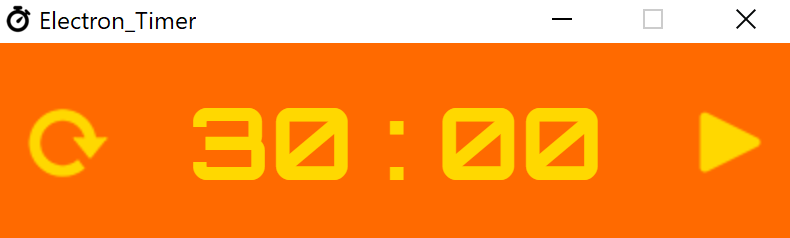

This is a simple timer made using only electron, html, css and javascript.

Features:
===
* Play, pause, restart
* Manual time entry
* Minimize to tray

Running instructions:
===
1. npm install
2. npm start
